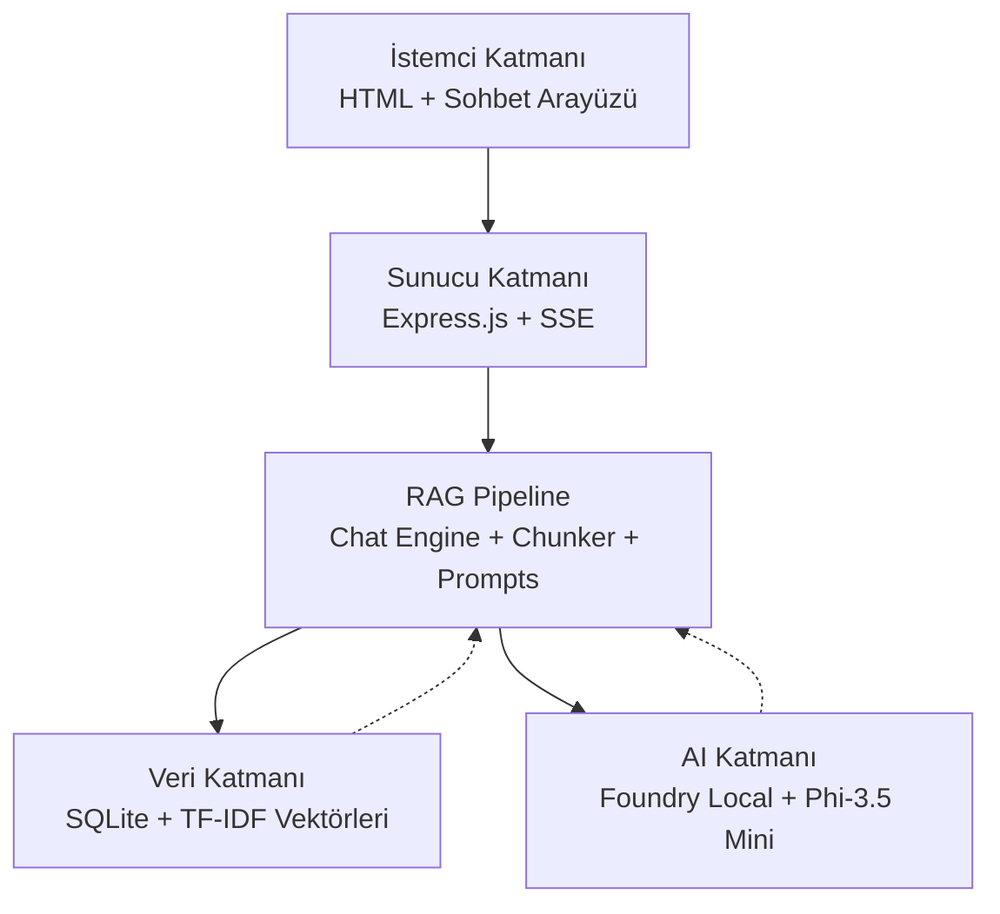
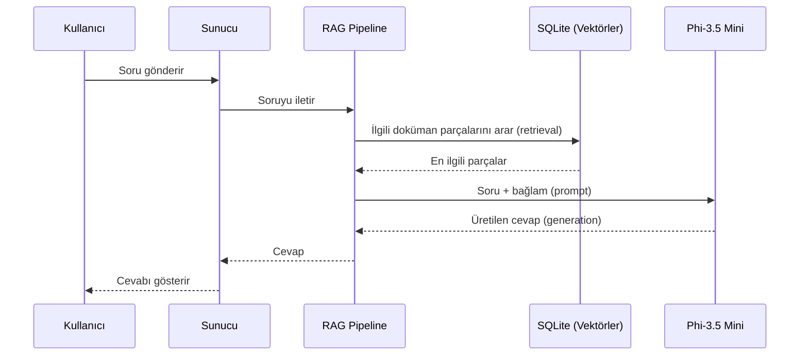

# 🧠 Yerel RAG Destek Asistanı (Foundry Local)

> Tamamen **çevrimdışı** çalışan, dokümanlarınıza soru sorabildiğiniz bir yapay zeka asistanı.
> Bulut yok, API anahtarı yok, dış ağ çağrısı yok — her şey laptop üzerinde.

**Microsoft AI Innovators Summer Internship** kapsamında geliştirilmiştir.

---

## 📌 Proje Nedir?

İnternet bağlantısının bulunmadığı ortamlarda (uzak saha, fabrika, yeraltı tesisi)
çalışan bir yapay zeka destek asistanı. **RAG (Retrieval-Augmented Generation)** deseni
sayesinde model, cevaplarını uydurmak yerine yüklenen dokümanlardan üretir; böylece
daha az halüsinasyon ve izlenebilir cevaplar sağlar.

---

## 🏗️ Mimari

Sistem, tek makinede çalışan 5 katmandan oluşur:



### Soru-Cevap Akışı



---

## 🛠️ Teknoloji Yığını

| Katman | Teknoloji |
|---|---|
| İstemci | HTML / CSS / JavaScript |
| Sunucu | Node.js + Express.js |
| Veri | SQLite (better-sqlite3) |
| Yapay Zeka | Foundry Local + Phi-3.5 Mini |
| Erişim (Retrieval) | TF-IDF vektörleştirme |

**Bağımlılıklar:** `express`, `foundry-local-sdk`, `better-sqlite3` (framework yok, Docker yok, build adımı yok)

---

## 🚀 Kurulum ve Çalıştırma

> **Ön koşul:** [Node.js](https://nodejs.org) ve [Foundry Local](https://learn.microsoft.com/azure/ai-foundry/foundry-local/get-started) kurulu olmalıdır.

```bash
# 1. Repoyu klonla
git clone https://github.com/SemanurBuhan/local-rag-foundry.git
cd local-rag-foundry

# 2. Bağımlılıkları yükle
npm install

# 3. Dokümanları indeksle (docs/ klasöründeki .md dosyaları)
npm run ingest

# 4. Sunucuyu başlat
npm start
```

Ardından tarayıcıdan aç: **http://127.0.0.1:3000**

---

## 🎥 Proje Tanıtım Videosu

> Projenin ne yaptığını, özelliklerini ve bu projeden neler öğrendiğimi anlattığım video:

**▶️ ...

---

## 📚 Bu Projeden Neler Öğrendim?

- RAG (Retrieval-Augmented Generation) mimarisinin nasıl kurulduğunu
- Yerel (offline) LLM çalıştırmayı — Foundry Local & Phi-3.5 Mini
- TF-IDF ile basit ama etkili bir vektör arama (retrieval) yapmayı
- Express.js ile SSE (Server-Sent Events) kullanarak durum bildirimi göndermeyi
- Clean Code / SOLID prensiplerini gerçek bir projede uygulamayı
- Git branch stratejisi ile düzenli bir commit geçmişi oluşturmayı

---

## 📄 Dokümantasyon

Gereksinim analizi ve mühendislik dokümanı için: [`GEREKSINIM_DOKUMANI.md`](./GEREKSINIM_DOKUMANI.md)

---

## 📝 Lisans

MIT
