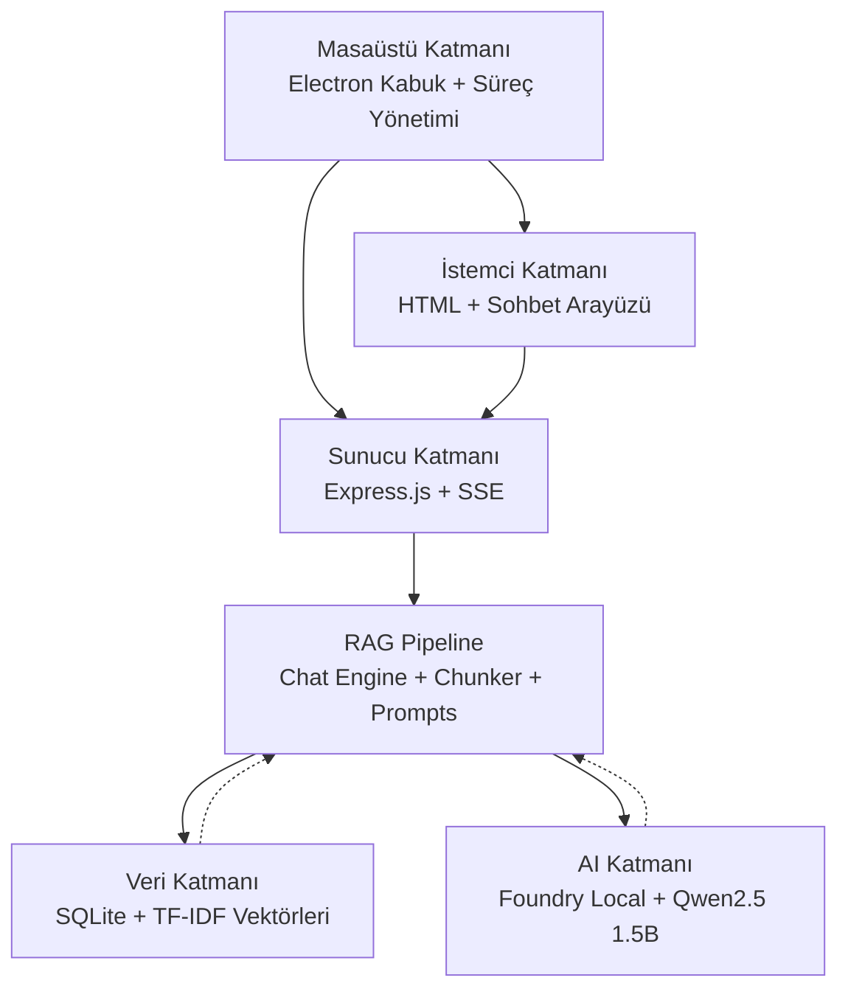
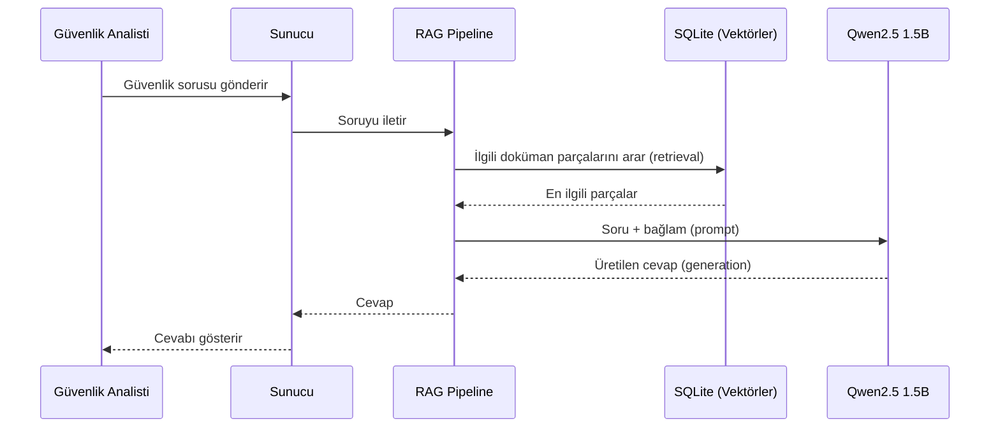
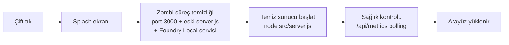

# 🔐 ShadowSec — Yerel Siber Güvenlik Destek Asistanı (Foundry Local)

> Tamamen **çevrimdışı** çalışan, siber güvenlik dokümanlarınıza soru sorabildiğiniz bir yapay zeka asistanı.
> Bulut yok, API anahtarı yok, dış ağ çağrısı yok — hassas veriler cihazdan hiç çıkmaz.
> Web tarayıcısından **veya** kendi simgesi, açılış ekranı ve otomatik süreç yönetimiyle **masaüstü uygulaması** olarak çalışır.

**Microsoft AI Innovators Summer Internship** kapsamında geliştirilmiştir.

---

## 📌 Proje Nedir?

Güvenlik ekipleri hassas verilerle çalışır; bir bulut yapay zekasına soru sormak veri
sızıntısı riski taşır. Bu proje, **tamamen yerel (offline)** çalışan bir siber güvenlik
destek asistanıdır. İnternet bağlantısı olmayan veya güvenlik gereği izole (air-gapped)
ortamlarda, bir güvenlik analistinin sorularını yüklenen dokümanlardan cevaplar.

**RAG (Retrieval-Augmented Generation)** deseni sayesinde model, cevaplarını uydurmak
yerine yüklenen güvenlik dokümanlarından üretir; böylece daha az halüsinasyon ve
izlenebilir cevaplar sağlar.

### Örnek Sorular
- "SQL injection saldırısı nasıl önlenir?"
- "OWASP Top 10'da Broken Access Control nedir?"
- "Güvenli parola saklama için ne yapmalıyım?"
- "XSS saldırısı türleri nelerdir?"

---

## 🏗️ Mimari

Sistem, tek makinede çalışan 6 katmandan oluşur. Masaüstü katmanı (Electron) diğer
katmanların üzerinde bir kabuk gibi çalışır; mevcut web arayüzü ve sunucu koduna
**tek satır dokunulmadan** eklenmiştir.


```mermaid
flowchart TD
    F[Masaüstü Katmanı<br/>Electron Kabuk + Süreç Yönetimi] --> A
    F --> B
    A[İstemci Katmanı<br/>HTML + Sohbet Arayüzü] --> B[Sunucu Katmanı<br/>Express.js + SSE]
    B --> C[RAG Pipeline<br/>Chat Engine + Chunker + Prompts]
    C --> D[Veri Katmanı<br/>SQLite + TF-IDF Vektörleri]
    C --> E[AI Katmanı<br/>Foundry Local + Qwen2.5 1.5B]
    D -.-> C
    E -.-> C
```

### Soru-Cevap Akışı


```mermaid
sequenceDiagram
    participant K as Güvenlik Analisti
    participant S as Sunucu
    participant R as RAG Pipeline
    participant V as SQLite (Vektörler)
    participant M as Qwen2.5 1.5B

    K->>S: Güvenlik sorusu gönderir
    S->>R: Soruyu iletir
    R->>V: İlgili doküman parçalarını arar (retrieval)
    V-->>R: En ilgili parçalar
    R->>M: Soru + bağlam (prompt)
    M-->>R: Üretilen cevap (generation)
    R-->>S: Cevap
    S-->>K: Cevabı gösterir
```

### Masaüstü Uygulaması Açılış Akışı

Simgeye çift tıklandığında Electron kabuğu dört aşamalı bir **tam sıfırlama** yapar,
ardından tertemiz bir sunucu başlatır:


```mermaid
flowchart LR
    A[Çift tık] --> B[Splash ekranı]
    B --> C[Zombi süreç temizliği<br/>port 3000 + eski server.js<br/>+ Foundry Local servisi]
    C --> D[Temiz sunucu başlat<br/>node src/server.js]
    D --> E[Sağlık kontrolü<br/>/api/metrics polling]
    E --> F[Arayüz yüklenir]
```

Uygulama kapatıldığında sunucu ve Foundry Local servisi de birlikte kapatılır —
geride zombi süreç kalmaz.

---

## 🛠️ Teknoloji Yığını

| Katman | Teknoloji |
|---|---|
| Masaüstü | Electron (kabuk + süreç yaşam döngüsü yönetimi) |
| İstemci | HTML / CSS / JavaScript (responsive) |
| Sunucu | Node.js + Express.js |
| Veri | SQLite (better-sqlite3) |
| Yapay Zeka | Foundry Local + Qwen2.5 1.5B |
| Erişim (Retrieval) | TF-IDF vektörleştirme |

**Bağımlılıklar:** `express`, `foundry-local-sdk`, `better-sqlite3` + geliştirme için `electron` (framework yok, Docker yok, build adımı yok)

> **Mimari not:** `better-sqlite3` native bir modül olduğundan sunucu, Electron'un
> içine gömülmek yerine sistem Node'u ile **ayrı bir süreç** olarak çalıştırılır.
> Böylece Electron için yeniden derleme (rebuild) gerekmez ve web'de çalışan kod
> masaüstünde de değişmeden çalışır.

---

## 📂 Proje Yapısı

```
local-rag-foundry/
├── src/                  # Sunucu + RAG pipeline
│   ├── server.js         # Express sunucu, SSE durum yayını, /api/chat
│   ├── chatEngine.js     # Soru-cevap motoru (Foundry Local)
│   ├── chunker.js        # Doküman parçalama
│   ├── vectorStore.js    # TF-IDF vektör deposu (SQLite)
│   ├── ingest.js         # Doküman indeksleme
│   ├── prompts.js        # Prompt şablonları
│   ├── metrics.js        # Sistem metrikleri
│   └── config.js         # Model, port ve yol ayarları
├── public/               # Web arayüzü (HTML/CSS/JS, responsive)
├── desktop/              # Masaüstü uygulama katmanı (Electron)
│   ├── main.cjs          # Ana süreç: temizlik, sunucu başlatma, sağlık kontrolü
│   ├── splash.html       # Açılış (yükleme) ekranı
│   ├── app.ico           # Uygulama simgesi (16–256 px, 6 boyut)
│   ├── create-shortcut.ps1  # Masaüstü kısayolu oluşturucu
│   └── server.log        # Her açılışta yenilenen sunucu logu
├── docs/                 # Bilgi tabanı (siber güvenlik dokümanları)
├── data/                 # SQLite veritabanı (rag.db)
└── KURULUM.bat           # Masaüstü uygulaması tek tıklık kurulum
```

---

## 📂 Bilgi Tabanı

Asistanın uzmanlık alanı `docs/` klasöründeki siber güvenlik dokümanlarından oluşur:

- `owasp-top-10.md` — OWASP Top 10 web uygulama güvenlik riskleri
- `ag-guvenligi-temelleri.md` — Temel ağ güvenliği kavramları
- `guvenli-kod-yazma.md` — Güvenli kod yazma pratikleri
- `saldiri-turleri.md` — Yaygın saldırı türleri (XSS, CSRF, phishing, ransomware...)
- `savunma-ve-araclar.md` — Savunma yöntemleri ve araçlar (SIEM, IDS/IPS, pentest)
- `kriptografi-ve-kimlik.md` — Kriptografi, hashing, JWT, OAuth, MFA
- `uygulama-ve-sistem-guvenligi.md` — API, bulut, container ve mobil güvenliği

Yeni bir doküman eklemek için `docs/` klasörüne `.md` dosyası koyup `npm run ingest` komutunu tekrar çalıştırman yeterli.

---

## 🚀 Kurulum ve Çalıştırma

> **Ön koşul:** [Node.js](https://nodejs.org) ve [Foundry Local](https://learn.microsoft.com/azure/ai-foundry/foundry-local/get-started) kurulu olmalıdır.

```bash
# 1. Repoyu klonla
git clone https://github.com/SemanurBuhan/local-rag-foundry.git
cd local-rag-foundry

# 2. Bağımlılıkları yükle
npm install

# 3. Dokümanları indeksle (docs/ klasöründeki .md dosyaları)
npm run ingest
```

### Seçenek A — Masaüstü Uygulaması (önerilen)

```
KURULUM.bat  →  çift tıkla
```

Kurulum betiği Electron'u indirir ve masaüstüne **ShadowSec** kısayolunu oluşturur
(tek seferlik, ~2 dk). Sonrasında masaüstündeki simgeye çift tıklaman yeterli:
uygulama önce zombi süreçleri temizler, tertemiz bir sunucu başlatır ve arayüzü
kendi penceresinde açar. Pencere hangi boyuta getirilirse getirilsin arayüz
kendini ölçekler; uygulama kapatılınca tüm arka plan süreçleri de kapanır.

> Kurulum betiği savunmacıdır: npm'in güvenlik politikası Electron'un ikili (binary)
> dosyasının inmesini engellerse bunu tespit eder ve indirme betiğini kendisi çalıştırır.

### Seçenek B — Web Tarayıcısı

```bash
npm start
```

Ardından tarayıcıdan aç: **http://127.0.0.1:3000**

| Komut | Ne yapar? |
|---|---|
| `npm start` | Sunucuyu başlatır (web modu) |
| `npm run ingest` | `docs/` içindeki dokümanları indeksler |
| `npm run app` | Masaüstü uygulamasını komut satırından başlatır |

---

## 🖥️ Masaüstü Uygulaması — Öne Çıkanlar

- **Tam sıfırlama:** Açılışta port 3000'i kilitleyen zombi node süreçleri, unutulmuş
  `server.js` kopyaları ve Foundry Local servisi kapatılır; sistem her zaman temiz başlar.
- **Kanıta dayalı hazırlık:** Sunucuya "hazır" varsayımı yapılmaz; `/api/metrics`
  uç noktasına sağlık kontrolü atılır, ancak cevap gelince arayüz yüklenir.
- **Tek örnek kilidi:** Uygulama ikinci kez açılırsa yeni pencere yerine mevcut
  pencere öne getirilir — çift sunucu çalışması engellenir.
- **Temiz kapanış:** Pencere kapatıldığında sunucu ve model servisi birlikte sonlandırılır.
- **Loglama:** Sunucunun tüm çıktısı `desktop/server.log` dosyasına yazılır;
  bir sorun olursa hata penceresi kullanıcıyı bu dosyaya yönlendirir.
- **Özgün açılış ekranı:** Sunucu ayağa kalkarken uygulama temasıyla uyumlu,
  animasyonlu bir splash ekranı gösterilir.

---

## 🎥 Proje Tanıtım Videosu

> Projenin ne yaptığını, özelliklerini ve bu projeden neler öğrendiğimi anlattığım video:

**▶️ ....

---

## 📚 Bu Projeden Neler Öğrendim?

- RAG (Retrieval-Augmented Generation) mimarisinin nasıl kurulduğunu
- Yerel (offline) LLM çalıştırmayı — Foundry Local & Qwen2.5 1.5B
- TF-IDF ile basit ama etkili bir vektör arama (retrieval) yapmayı
- Express.js ile SSE (Server-Sent Events) kullanarak durum bildirimi göndermeyi
- Veri gizliliğinin (air-gapped / offline AI) neden önemli olduğunu
- Electron ile bir web uygulamasını masaüstü uygulamasına dönüştürmeyi
- İşletim sistemi seviyesinde süreç yaşam döngüsü yönetimini — port tarama,
  süreç sonlandırma, servis kontrolü
- Savunmacı programlamayı: sağlık kontrolü, zaman aşımı ve dosya doğrulamasıyla
  hiçbir adımın "çalıştığını varsaymadan" sonucu kanıtlamayı
- Katman ayrımının (separation of concerns) gücünü — masaüstü katmanı,
  mevcut koda dokunmadan eklendi
- npm'in tedarik zinciri güvenlik önlemlerinin geliştirici tarafında nasıl
  hissedildiğini (engellenen kurulum betiklerini tespit edip telafi etmeyi)
- Clean Code / SOLID prensiplerini gerçek bir projede uygulamayı
- Git branch stratejisi ile düzenli bir commit geçmişi oluşturmayı

---

## 📄 Dokümantasyon

Gereksinim analizi ve mühendislik dokümanı için: [GEREKSINIM_DOKUMANI.md](./GEREKSINIM_DOKUMANI.md)

---

## 📝 Lisans

MIT
